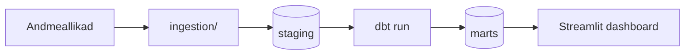

# Õhuhunt — Eesti õhukvaliteedi analüütika

*Andmetoru, mis kõnetab su hingetoru*

## Äriküsimus

Kui tugev on statistiline seos õhukvaliteedi ning ilmastikutegurite (temperatuur, sademed, tuulekiirus) ja liiklussageduse vahel Eesti linnades? Eesmärk on tuvastada, milliste ilmastiku- ja liiklustingimuste koosesinemisel on saasteainete kontsentratsioon õhus kõige madalam või kõige kõrgem. Õhukvaliteeti hinnatakse saasteainete (SO2, NO2, O3, PM10, PM2.5) kontsentratsiooni alusel — mida madalam kontsentratsioon, seda parem õhukvaliteet. Analüüs hõlmab kolme uurimispiirkonda — Tallinn, Tartu ja Narva — ning katab perioodi jaanuar 2024 kuni käesolev kuu.

Tulemused on nähtavad dashboardil: [est-air-quality-monitor.streamlit.app](https://est-air-quality-monitor.streamlit.app)

**Mõõdikud:**

1. Saasteaine kontsentratsiooni seos liiklussageduse ja ilmastikuteguritega — hajuvusdiagrammid Pearson **r** korrelatsioonikordajaga iga linna vahekaardil
2. Kõige saastatum kuu — iga saasteaine ja linna kohta kõrgeima kuukeskmise kontsentratsiooniga kuu (µg/m³)
3. Tuulekiiruse ja liiklussageduse korrelatsioon saasteainetega — automaatne järeldus, kumb näitab tugevamat statistilist seost

## Arhitektuur



Täpsem kirjeldus: [docs/arhitektuur.md](docs/arhitektuur.md)

## Andmestik

| Allikas | Tüüp | Ajas muutuv? | Roll |
| --- | --- | --- | --- |
| [f_kliima_tund](https://keskkonnaandmed.envir.ee/f_kliima_tund) | Avalik HTTP API | Jah, iga tund | Tunnipõhised ilmavaatlused (temperatuur, sademed, tuulekiirus) |
| [ohuseire.ee](https://ohuseire.ee/api/monitoring/et) | Pool-avalik API | Jah, pidevalt | Õhukvaliteedi seireandmed (SO2, NO2, O3, PM10, PM2.5) |
| [Tark Tee](https://tarktee.mnt.ee/tarktee/rest/services/traffic_detectors/MapServer) | Avalik ArcGIS REST | Jah, iga tund | Liiklusdetektorite tunnipõhised mõõtmised |
| Liikluse ajaloolised CSV-d | Kohalik sisendfail | Ei, staatiline | Ajalooline liiklussagedus backfilli jaoks |

## Stack

| Komponent | Tööriist |
| --- | --- |
| Sissevõtt | Python (`ingestion/`) |
| Transformatsioon | dbt |
| Andmehoidla | PostgreSQL + DuckDB |
| Näidikulaud | Streamlit + Altair + Folium |
| Orkestreerimine | Apache Airflow (`@hourly`) |
| Keskkond | Docker Compose |

## Käivitamine

```
# 1. Klooni repo ja liigu kausta
git clone <repo-url>
cd airwolf

# 2. Kopeeri keskkonnamuutujad
cp .env.example .env
# Täida .env-is liikluse sisendfailide teed

# 3. Käivita teenused
docker compose up -d --build
```

Airflow UI: http://localhost:8080 (kasutaja: airflow / parool: airflow)  
Dashboard: http://localhost:8501

## Saladused ja konfiguratsioon

Kõik saladused (paroolid, andmebaasi URL-id) on `.env` failis. Repos on ainult `.env.example`, mis näitab vajalike muutujate struktuuri ilma tegelike väärtusteta. Päris `.env` faili ei tohi GitHubi panna — see on `.gitignore`-s.

| Muutuja | Tähendus |
| --- | --- |
| `POSTGRES_PASSWORD` | PostgreSQL parool |
| `TRAFFIC_BACKFILL_CSV` | Liikluse ajalooliste andmete CSV faili tee |
| `TRAFFIC_STATIONS_FILE` | Liiklusdetektorite asukohtade faili tee (CSV või XLSX) |
| `MATCH_RADIUS_METERS` | Jaamade ja detektorite geograafilise sobitamise raadius (vaikimisi 5000) |

## Andmevoog lühidalt

1. **Sissevõtt** — `ingestion/` skriptid laevad tunnipõhised andmed kolmest allikast (ilm, õhukvaliteet, liiklus) PostgreSQL `staging` skeemi. Airflow DAG käivitab sissevõtu automaatselt iga tund.
2. **Laadimine** — Andmed salvestatakse `staging` kihti UPSERT loogikaga — korduvad käivitused ei tekita duplikaate.
3. **Transformatsioon** — dbt mudelid puhastavad, standardiseerivad ja sobitavad andmed ruumiliselt ning ajaliselt `intermediate` ja `marts` skeemidesse.
4. **Testimine** — `dbt test` käivitab andmekvaliteedi kontrollid automaatselt pärast iga transformatsiooni. Tulemused logitakse Airflow task logidesse.
5. **Näidikulaud** — Streamlit rakendus loeb `marts` kihi tabeleid ja kuvab tulemused neljal vahekaardil: Tallinn, Narva, Tartu ja Võrdlused.

## Andmekvaliteedi testid

Testid käivitab `dbt test` automaatselt pärast iga `dbt run`-i. Tulemused logitakse Airflow task logidesse.

1. `station_id` ja `detector_id` ei ole null — kõigis kolmes intermediate mudelis
2. `obs_time` ei ole null — kõigis mudelites
3. `area` on üks kolmest lubatud väärtusest: `tallinn`, `tartu`, `narva` — kõigis intermediate mudelites
4. `mart_joined.area` ja `mart_joined.obs_time` ei ole null — dashboardi peamise sisendtabeli kontroll

## Projekti struktuur

    ingestion/             — andmete laadimine (ilm, õhukvaliteet, liiklus)
    dbt_project/           — transformatsioonid ja mart-kihi mudelid
    dags/                  — Airflow DAG igapäevaseks käivituseks
    sql/                   — andmebaasi skeemid ja tabelite loomine
    data/mart/             — mart-kihi andmefailid (dashboardi sisend)
    docs/                  — arhitektuur ja dokumentatsioon
    streamlit_app.py       — dashboard
    compose.yml            — Docker Compose seadistus
    .env.example           — keskkonnamuutujate näidis


## Kokkuvõte, puudused ja võimalikud edasiarendused

Kokkuvõte: Uurisime seost nii liiklussageduse kui ka ilmastikunähtustega. Esialgne analüüs viitab suuremat seost pigem ilmastikuga, eriti tuulekiirusega, kui liiklusega. Nagu kaartidelt nähtub, on eri näitajate mõõdistuspunktid eri asukohtadega ja nende paiknemistihedus varieerub, siis peab arvestama võimalikest ruumilistest variatsioonidest tulenevate tulemuste ebatäpsuse või moonutusega. võimalik, et liiklusest tingitud keskkonnamõjud on loomult liiga lokaalsed, et üldmõõdistusi märkimisväärselt mõjutada.
-

**Puudused:**

-

**Mis edasi:**


## Dokumentatsioon

Täpsem ülevaade arhitektuurist, andmevoogudest, mõõdikutest ja tööjaotusest: [docs/arhitektuur.md](docs/arhitektuur.md)
