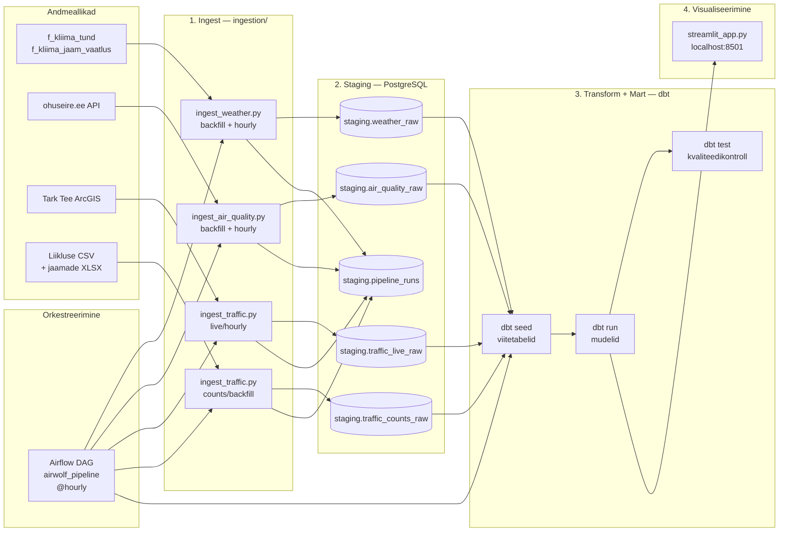

# Arhitektuur

## Äriküsimus

Kas, kuidas ja millisel määral sõltuvad Eesti linnades (Tallinn, Tartu ja Narva) mõõdetud SO2, PM10, PM2.5, NO2 ja O3 kontsentratsioonid ilmastikunähtustest (nt tuul, sademed, temperatuur) ning liiklussagedusest? Millistes Eesti linnades ja mis aegadel tagab ilmastiku ning liiklussageduse koosmõju kõige puhtama/saastatuma õhukvaliteedi?

Kuna 2026. aasta õhukvaliteedi mõõtmiste andmeid ei ole veel avalikustatud, tehakse esialgne PoC 2025. aasta kohta.

## Mõõdikud

1. **Saasteaine kontsentratsiooni seos liiklussageduse ja ilmastikuteguritega**
   SO2, PM10, PM2.5, NO2 ja O3 tunnikeskmiste kontsentratsioonide seos liiklussageduse, temperatuuri, sademete ja tuulekiirusega. Kuvatakse **Analüütika** vahekaardil hajuvusdiagrammidena koos lineaarse trendijoone ja Pearson **r** korrelatsioonikordajaga. Indikaator on kasutaja poolt valitav.

2. **Kõige saastatum kuu**
   Iga saasteaine ja linna kohta kuvatakse **Võrdlused** vahekaardil kuukeskmised kontsentratsioonid ning kõrgeima väärtusega kuu koos kontsentratsiooniga (µg/m³).

3. **Tuulekiiruse ja liiklussageduse korrelatsioon saasteainetega**
   Iga saasteaine kohta kuvatakse **Võrdlused** vahekaardil Pearson **r** korrelatsioonikordajad tuulekiiruse ja liiklussagedusega kolme linna lõikes, koos automaatse järeldusega, kumb näitab tugevamat statistilist seost.

### Mõõdikud dashboardil

1. **Saasteaine kontsentratsiooni seos liiklussageduse ja ilmastikuteguritega**
   SO2, PM10, PM2.5, NO2 ja O3 tunnikeskmiste kontsentratsioonide seos liiklussageduse, temperatuuri, sademete ja tuulekiirusega. Kuvatakse **Analüütika** vahekaardil hajuvusdiagrammidena koos lineaarse trendijoone ja Pearson **r** korrelatsioonikordajaga. Indikaator on kasutaja poolt valitav.

2. **Kõige saastatum kuu**
   Iga saasteaine ja linna kohta kuvatakse **Võrdlused** vahekaardil kuukeskmised kontsentratsioonid ning kõrgeima väärtusega kuu koos kontsentratsiooniga (µg/m³).

3. **Tuulekiiruse ja liiklussageduse korrelatsioon saasteainetega**
   Iga saasteaine kohta kuvatakse **Võrdlused** vahekaardil Pearson **r** korrelatsioonikordajad tuulekiiruse ja liiklussagedusega kolme linna lõikes, koos automaatse järeldusega, kumb näitab tugevamat statistilist seost.

## Andmeallikad

| Allikas | Link | Tüüp | Ajas muutuv? | Roll |
| --- | --- | --- | --- | --- |
| `f_kliima_tund` (ilmavaatlused) | `https://keskkonnaandmed.envir.ee/f_kliima_tund` | Avalik HTTP API | Jah, uueneb iga tund | Tunnipõhised ilmavaatlused: temperatuur, sademed, tuulekiirus ja tuulesuund |
| `f_kliima_jaam_vaatlus` | `https://keskkonnaandmed.envir.ee/f_kliima_jaam_vaatlus` | Avalik HTTP API | Pigem aeglaselt muutuv | Ilmajaamade koordinaadid ja metaandmed |
| `ohuseire.ee` | `https://ohuseire.ee/api/monitoring/et` | Pool-avalik API (kasutusel EKUKi kaardirakenduses) | Jah, uueneb pidevalt | Õhukvaliteedi seireandmed: SO2, NO2, O3, PM10, PM2.5 |
| `traffic_detectors` MapServer | `https://tarktee.mnt.ee/tarktee/rest/services/traffic_detectors/MapServer/0` | Avalik ArcGIS REST teenus | Jah, jooksev snapshot | Liiklusdetektorite tunnipõhised mõõtmised: liiklusvoog, raskeveokid, kiirus |
| Ajalooliste liiklussagedusandmete CSV | ⚠️ Algallikas täpsustamisel | Kohalik sisendfail | Ei | Ajalooline liiklussagedus, mis seotakse detektorite asukohtadega |
| Ajalooliste detektorite asukohtade fail | ⚠️ Algallikas täpsustamisel | Kohalik sisendfail (CSV või XLSX) | Ei | Detektorite koordinaadid ja nimed backfilli jaoks |
| OpenStreetMap | `https://www.openstreetmap.org` | Avalik kaardiandmestik | Jah | Aluskaart dashboardi kaardivaates |

### Andmeallikate kasutamise põhimõtted

- Projekti peamine analüüsitase on **tunnipõhine**, sest ilmavaatluste lähteallikas on `f_kliima_tund`.
- Ilmavaatlusandmeid kasutatakse kolmest jaamast: **Tallinn-Harku**, **Tartu-Tõravere** ja **Narva**.
- Õhukvaliteedi, ilmastiku ja liikluse andmed ühtlustatakse ühisele tunnitasemele, et nende omavahelisi seoseid saaks võrrelda samas ajavaates.
- Kui mõni andmeallikas on tunnitasemest detailsem või ebaühtlase ajasammuga, agregeeritakse või joondatakse see lähimale tunnisele vaatlusaknale.
- Projekti sisemine ruumiandmete referentssüsteem on **EPSG:3301**. Kaardivaates teisendatakse geomeetriad **EPSG:4326** formaati OpenStreetMapi jaoks.
- Analüüs teostatakse kolmel uurimisalal, mille piirid (BBOX) on:

| Ala | WGS84 NW nurk | WGS84 SE nurk | EPSG:3301 x_min | EPSG:3301 x_max | EPSG:3301 y_min | EPSG:3301 y_max |
|---|---|---|---:|---:|---:|---:|
| Tallinn | lat_n: 59.554594, lon_w: 24.474231 | lat_s: 59.361424, lon_e: 25.012994 | 526818 | 557609 | 6580812 | 6601992 |
| Narva | lat_n: 59.398837, lon_w: 28.099803 | lat_s: 59.342551, lon_e: 28.211009 | 732765 | 739464 | 6585793 | 6591660 |
| Tartu | lat_n: 58.426894, lon_w: 26.455566 | lat_s: 58.248549, lon_e: 26.780029 | 643432 | 663197 | 6459800 | 6478907 |

## Andmevoog

### Andmevoo selgitus

1. **Airflow DAG** (`dags/airwolf_pipeline.py`) orkestreerib kogu töövoo ja käivitub iga tund (`@hourly`). Iga jooksu staatus (käivitusaeg, allikas, tulemus) salvestatakse `staging.pipeline_runs` tabelisse.

2. **Ingest-skriptid** (`ingestion/`) laevad andmed staging skeemi:
   - `ingest_weather.py` — ilmavaatlused (`staging.weather_raw`); toetab backfilli ja tunnipõhist laadimist
   - `ingest_air_quality.py` — õhukvaliteedi andmed (`staging.air_quality_raw`); toetab backfilli ja tunnipõhist laadimist
   - `ingest_traffic.py` — liiklusdetektorite live-andmed (`staging.traffic_live_raw`) tunnipõhiselt ja ajaloolised CSV andmed (`staging.traffic_counts_raw`) käsitsi backfillina
   - Kõik ingest-skriptid kasutavad UPSERT-i, seega korduvad käivitused ei tekita duplikaate

3. **dbt** transformeerib staging andmed mart-kihi mudeliteks:
   - `dbt seed` laeb viitetabelid (jaamade koordinaadid jm)
   - `dbt run` ehitab `intermediate` ja `marts` skeemi mudelid
   - `dbt test` kontrollib andmekvaliteeti

4. **Streamlit dashboard** (`streamlit_app.py`) loeb mart-kihi tabeleid ja kuvab tulemused kolme vahekaardiga: **Mõõdistus- ja vaatlusandmed**, **Analüütika**, **Võrdlus**.

## Andmebaasi kihid

| Kiht | Skeem | Haldaja | Roll |
| --- | --- | --- | --- |
| `staging` | `staging` | `ingestion/` + `sql/create_tables.sql` | Hoiab API-dest ja CSV-failidest laetud toorandmeid allikalähedasel kujul koos laadimisaja ja pipeline'i metaandmetega |
| `intermediate` | `intermediate` | dbt | Hoiab standardiseeritud, puhastatud ja ruumiliselt/ajaliselt sobitatud vahetabeleid, mida kasutatakse mart-kihi sisendina |
| `marts` | `marts` | dbt | Hoiab analüüsiks ja dashboardiks vajalikke faktitabeleid ja koondeid |

### Kihtide kasutamise põhimõtted

- Iga pipeline'i käivitus saab unikaalse `run_id`, mis seob kõik sellel käivitusel laetud read `staging.pipeline_runs` tabeli kirjega.
- `staging` kihti ei kirjutata üle — UPSERT loogika tagab, et olemasolevad read uuendatakse ja uued lisatakse, ajalugu säilib.
- `intermediate` ja `marts` kihte haldab dbt — mudelid ehitatakse iga DAG käivitusega uuesti.
- Andmekvaliteedi kontrollid käivitab `dbt test` pärast `dbt run`-i. Tulemused logitakse Airflow task logidesse.
- Dashboard loeb ainult `marts` kihi tabeleid.

## Andmekvaliteedi kontrollid

Kontrollid käivitab `dbt test` automaatselt pärast iga `dbt run`-i. Tulemused logitakse Airflow task logidesse.

### Ilmaandmed (`weather_raw`)

- nõutud väljad: `jaam_kood`, `obs_time`, `lat`, `lon`
- vähemalt üks mõõteväli peab olema olemas: `temperature_c`, `wind_speed_ms`, `precip_mm`
- koordinaatide vahemikukontroll (`lat`, `lon`)
- temperatuur, tuulekiirus ja sademed peavad jääma mõistlikku vahemikku

### Õhukvaliteedi andmed (`air_quality_raw`)

- nõutud väljad: `station`, `indicator`, `measured`
- vähemalt üks saasteaine veerg peab olema olemas: SO2, O3, NO2, PM10, PM25
- saasteainete väärtused peavad olema mitte-negatiivsed
- koordinaatide vahemikukontroll (`lat`, `lon`)

### Liikluse live-andmed (`traffic_live_raw`)

- nõutud väljad: `traffic_detector_id`, `measurement_time`, `x_3301`, `y_3301`
- liiklusvood peavad olema mitte-negatiivsed
- EPSG:3301 koordinaadid peavad jääma Eesti jaoks mõistlikku vahemikku

### Liikluse backfill (`traffic_counts_raw`)

- nõutud väljad: `id`, `kanal`, `aeg`
- sõidukite loendused peavad olema mitte-negatiivsed
- `area` peab olema üks kolmest: `tallinn`, `tartu`, `narva`

## Tööjaotus

| Vastutusala | Tegevused | Tegija |
| --- | --- | --- |
| Keskkonnaandmed ja liiklusandmed | Ilmavaatluste (`f_kliima_tund`, `f_kliima_jaam_vaatlus`), õhukvaliteedi ja liiklusandmete (`ingest_traffic.py`) päringute ja sissevõtu haldamine | Katrin |
| Transformatsioonid | dbt mudelite (`intermediate` ja `marts`) ehitamine, ruumilise sidumise loogika ja KPI arvutused | ⚠️ Kontrollida |
| Andmekvaliteet | Andmekvaliteedi testide (`dbt test`) loomine, ebaõnnestumiste jälgimine ja logide kontroll | ⚠️ Kontrollida |
| Dashboard | Streamlit rakenduse, kaardivaate ja kasutajaliidese arendamine | Hando |
| Dokumentatsioon | Arhitektuuridokumendi (`docs/arhitektuur.md`) ja README ajakohastamine | Hanna |

## Riskid

| Risk | Maandus |
| --- | --- |
| API muudab vastuse formaati → pipeline katkeb | Versioonikontroll ja alertid |
| `ohuseire.ee` pool-avalik API läheb kinni → andmed puuduvad | Alternatiivne allikas puudub, risk aktsepteeritud |
| Liiklusdetektori andmed on hetktõmmis, mitte ajaline rida → tunnipõhine kogumine võib jätta lünki | Backfill CSV-ga |
| Staging tabelid kasvavad liiga suureks → jõudlusprobleemid | Partitsioneerimine või arhiveerimine |
| Ruumiline sobitamine 5 km raadiuses sobitab vale detektori → vale seos | Visuaalne kontroll kaardil |
| Koordinaadid puuduvad mõnel detektoril → jäetakse analüüsist välja | Käsitsi täiendamine |
| DuckDB/pgDuckDB versioon ei ühildu PostgreSQL versiooniga → installimisviga | Lukustatud versioonid `compose.yml`-is |
| Dashboard näitab valesid tulemusi vaiksetel perioodidel (vähe andmeid) → kasutaja teeb valesid järeldusi | Andmete arvu kuvamine |
| Projekti andmeperiood on liiga lühike korrelatsioonide usaldatavaks hindamiseks | Andmete kogumine jätkub |
| Streamlit Community Cloud piirab mälu ja CPU ressursse → dashboard muutub aeglaseks või katkeb suure andmemahu korral | Jälgida ressursikasutust; kaaluda andmemahu piiramist dashboard tasandil |

## Privaatsus ja turvalisus

- Kõik andmeallikad on avalikud — isikuandmeid ei koguta.
- Andmebaasi paroolid ja ühendusandmed hoitakse `.env` failis, mitte koodis.
- `.env` fail on `.gitignore`-s ja ei tohi repo-sse sattuda.
- `ohuseire.ee` API ei nõua autentimist, kuid on pool-avalik — kasutada mõistlikult ja vältida tarbetuid päringuid.
- Liikluse sisendfailid (`LL jaamad.xlsx`, liikluse CSV-d) on kohalikud failid — hoida väljaspool versioonihallatavat kausta ja mitte lisada repo-sse.
