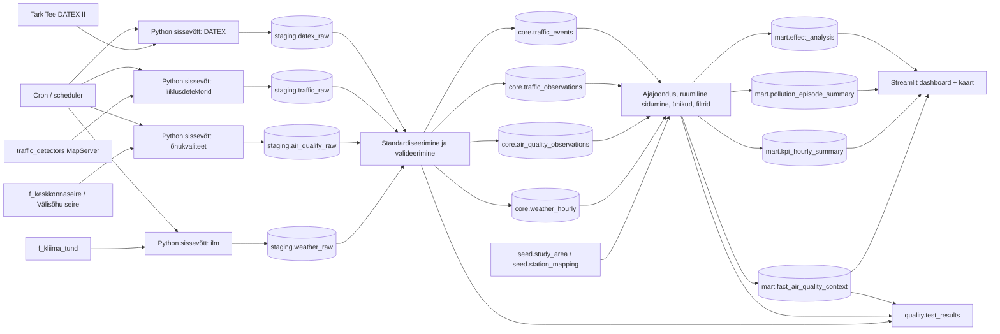

# Arhitektuur

## Äriküsimus

Kas, kuidas ja millisel määral sõltuvad Eesti asulates mõõdetud PM10, PM2.5, NO2 ja O3 kontsentratsioonid ilmastikunähtustest (nt tuul, sademed, temperatuur) ning liiklussagedusest? Millistes Eesti asulates ja mis aegadel tagab ilmastiku ning liiklussageduse koosmõju kõige puhtama/saastatuma õhukvaliteedi?

## Mõõdikud

1. **Saasteaine kontsentratsiooni seose tugevus ilmastikuteguritega**  
   PM10, PM2.5, NO2 ja O3 tunnikeskmiste või päevakeskmiste kontsentratsioonide seos tuulekiiruse, tuulesuuna, temperatuuri ja sademetega. Näidatakse korrelatsiooni, regressioonikordaja või muu mõju suuruse näitajana asula ja perioodi lõikes.

2. **Saasteaine kontsentratsiooni seose tugevus liiklussagedusega**  
   PM10, PM2.5, NO2 ja O3 kontsentratsiooni muutus liiklusvoo, raskeveokite osakaalu ja võimalusel keskmise kiiruse muutumisel.

3. **Kõrge saastetaseme episoodid ja neid saatvad tingimused**  
   Tundide või päevade arv, mil valitud saasteaine tase ületab kokkulepitud lävendi, ning millised ilma- ja liiklustingimused nende episoodidega kaasnesid.

4. **Piirkondlik riskiskoor või koondnäitaja**  
   Koondnäitaja, mis iseloomustab, millistes piirkondades ja tingimustes on kõrgema saastetaseme risk suurim.

### Võimalikud KPI-d dashboardil

- PM10, PM2.5, NO2 ja O3 keskmine kontsentratsioon valitud asulas/perioodil (näidata punasega kui on üle lubatud piirnormi)
- Korrelatsioon tuule, temperatuuri, sademete ja liiklussagedusega
- Vähese/kõrge saastetasemega päevade või tundide arv
- Ilma vs liikluse suhteline mõju valitud saasteainele

# Andmeallikad

| Allikas | Link | Tüüp | Ajas muutuv? | Roll |
|---|---|---|---|---|
| `f_kliima_tund` (`Ilmavaatlused`) | `https://keskkonnaandmed.envir.ee/f_kliima_tund` | Avalik HTTP API | Jah, ajas muutuv vaatluste andmestik | Tunnipõhised ilmavaatlused: temperatuur, sademed, tuul ja muud meteoroloogilised näitajad; kasutatakse õhukvaliteedi ja liiklusandmete sidumiseks ühisel tunnitasemel |
| `f_keskkonnaseire` (`Välisõhu seire`) | `https://keskkonnaandmed.envir.ee/f_keskkonnaseire` | Avalik HTTP API | Jah, üldjuhul uuendatakse regulaarselt | Õhukvaliteedi seireandmed: PM10, PM2.5, NO2, O3 ja seotud mõõtepunktid |
| Keskkonna ja ilma valdkonna andmeteenuste kirjeldus | `https://keskkonnaportaal.ee/avaandmed/keskkonna-ja-ilma-valdkonna-andmeteenused` | Dokumentatsioon | Jah | Tehniline kirjeldus `f_kliima_paev` ja `f_keskkonnaseire` päringute, filtrite ja kasutusreeglite jaoks |
| `traffic_detectors` MapServer | `https://tarktee.mnt.ee/tarktee/rest/services/traffic_detectors/MapServer` | Avalik ArcGIS REST teenus | Jah, teenus kuvab jooksvaid mõõtmisi | Liiklusdetektorite mõõtmised ja asukohad; kasutatakse liiklusvoo, raskeveokite osakaalu ja kiiruse näitajate jaoks |
| Tark Tee DATEX II juurdepääs | `https://tarktee.mnt.ee/#/et/datex` | API-võtmega teenus | Jah, jooksvad feedid | Lisakiht liiklus- ja teepiirangute sündmuste, mõõtekohtade ning võimalusel liiklusmõõtmiste rikastamiseks |
| Tark Tee DATEX II profiil | `https://tarktee.mnt.ee/assets/datex/DATEX_II_Estonian_profile_Tark_Tee.pdf` | Tehniline dokumentatsioon | Jah | DATEX II feedide kirjeldus, juurdepääsuloogika, feedide sisu ja piirangud |
| OpenStreetMap | `https://www.openstreetmap.org` | Avalik kaardiandmestik / aluskaart | Jah | Aluskaart ja kaardiaken Streamlitis |

### Andmeallikate kasutamise põhimõtted

- Projekti peamine analüüsitase on **MVP-s tunnipõhine**, sest ilmavaatluste lähteallikas on `f_kliima_tund`.
- Õhukvaliteedi, ilmastiku ja liikluse andmed ühtlustatakse võimalusel ühisele tunnitasemele, et nende omavahelisi seoseid saaks võrrelda samas ajavaates.
- Kui mõni andmeallikas on tunnitasemest detailsem või ebaühtlase ajasammuga, agregeeritakse või joondatakse see lähimale sobivale tunnisele vaatlusaknale.
- DATEX II andmeid kasutatakse täiendava rikastuskihina liiklussündmuste, piirangute ja teeolude konteksti lisamiseks, kui need on valitud piirkondade ja ajavahemike jaoks asjakohased.
- Projekti sisemine ruumiandmete referentssüsteem on **EPSG:3301**. Streamliti kaardivaates teisendatakse geomeetriad vajadusel **EPSG:4326** formaati, et need kuvataks korrektselt OpenStreetMapi kaardil.

## Andmevoog

### Andmevoo selgitus

1. Pythoni skriptid loevad andmed teenustest staging kihti võimalikult allikalähedasel kujul.  
2. Standardiseerimise käigus tehakse järgmised sammud:
   - huvipakkuvate asulate või seirealade filtreerimine;
   - aja ühtlustamine ühisele analüüsitasemele;
   - ühikute ühtlustamine;
   - koordinaatsüsteemide ühtlustamine EPSG:3301 peale;
   - dublikaatide eemaldamine ja põhiline skeemivalideerimine (andmetüübid, kohustuslikud väljad jms).
3. `core` kihis on juba ühtlustatud vaatlused allikate kaupa.  
4. `mart` kihis seotakse õhukvaliteedi vaatlused ilmastiku ja liiklusandmetega ning arvutatakse KPI-d, episoodid ja seoseanalüüsi väljundid.  
5. Streamlit dashboard kuvab nii kaardivaate kui ka valitud mõõdikute ajagraafikud, võrdlused ja koondid.  
6. Scheduler käivitab automaatse sissevõtu ja võimaliku backfill-protsessi.

## Andmebaasi kihid

| Kiht | Roll |
|---|---|
| `staging` | Hoiab API-dest saadud toorandmeid võimalikult allikalähedasel kujul koos laadimisaja ja tehnilise metaandmestikuga. |
| `intermediate` | Hoiab standardiseeritud, ühtlustatud, puhastatud ja ruumiliselt/ajaliselt sobitatud vahetabeleid, mida kasutatakse analüüsi- ja mart-kihi sisendina. |
| `mart` | Hoiab analüüsiks ja dashboardiks vajalikke faktitabeleid, koondeid, episoodide tabeleid ja seoseanalüüsi tulemusi. |
| `quality` | Hoiab andmekvaliteedi kontrollide tulemusi, jooksutuste staatust ja võimalikke vigade logisid. |

### Kihtide kasutamise põhimõtted

- Iga töövoo käivitus saab unikaalse `run_id`.
- `staging` kihti ei kirjutata üle, vaid sinna jäävad alles ajaloo jooksul laetud andmed auditiks ja backfilliks.
- `mart` kihi tabelid võib ehitada igal käivitusel uuesti või inkrementaalselt, sõltuvalt andmemahust.
- Dashboard loeb ainult viimase eduka töövoo tulemusi.

## Andmekvaliteedi kontrollid

Vähemalt järgmised kontrollid tehakse automaatselt:

1. **Not null kontrollid**  
   Kohustuslikud väljad nagu mõõtmise aeg, jaama/seirekoha identifikaator, näitaja nimetus ja väärtus ei tohi olla tühjad.

2. **Loogiliste vahemike kontrollid**  
   Näiteks saasteainete kontsentratsioonid, temperatuur, sademed, tuulekiirus ja liiklusmaht peavad jääma mõistlikesse vahemikesse.

3. **Unikaalsuse kontrollid**  
   Sama allika puhul ei tohi sama mõõtekoha, näitaja ja ajamomendi kombinatsioon korduda ootamatult mitu korda.

4. **Ruumilise sobituse kontroll**  
   Õhukvaliteedi vaatlus peab olema seotud vähemalt ühe ilmavaatluspunkti ja ühe liiklusallikaga või olema selgelt märgitud sidumata vaatluseks.

5. **Ajalise katvuse kontroll**  
   Kontrollitakse, et analüüsi minevad perioodid oleksid piisava andmekattega ning et ühe allika puudumine ei moonutaks koondtulemusi.

## Tööjaotus

| Roll | Vastutus |
|---|---|
| Ilmaandmete omanik | Kontrollib `f_kliima_tund` päringuid, sissevõttu ja ilmavaatluste standardiseerimist |
| Õhukvaliteedi andmete omanik | Kontrollib `f_keskkonnaseire` päringuid, välisõhu seire filtreid ja saasteainete andmete kvaliteeti | 
| Liiklusandmete omanik | Vastutab `traffic_detectors` ja DATEX teenuste päringute, API-võtme kasutuse ja liiklusandmete normaliseerimise eest | 
| Transformatsioonide omanik | Ehitab `core` ja `mart` kihi mudelid, ruumilise sidumise loogika ja KPI arvutused | 
| Kvaliteedi omanik | Loob andmekvaliteedi testid, jälgib ebaõnnestumisi ja kontrollib logisid |
| Dashboardi omanik | Arendab Streamlit rakendust, kaardivaadet ja kasutajaliidest | 

Väikeses grupis võib üks inimene täita mitut rolli.

## Riskid

| Risk | Mõju | Maandus |
|---|---|---|
| API ei vasta või päring ebaõnnestub | Andmed ei uuene ja dashboard võib kuvada aegunud seisu | Skript logib vea, teeb piiratud arv kordi korduspäringuid ja jätab alles viimase eduka laadimise. Dashboardil kuvatakse viimase eduka uuenduse aeg. |
| Lähteandmete struktuur muutub | Töövoog katkeb või osa välju jääb laadimata | Skeemivalideerimine kontrollib kohustuslike väljade olemasolu enne edasist töötlust. Vigane laadimine märgitakse ebaõnnestunuks. |
| Eri andmestike ruumiline jaotus on väga erinev | Seoseanalüüsi ei saa kõigis piirkondades usaldusväärselt teha | PoC tehakse esmalt suuremate linnade või valitud näidisalade põhjal, kus õhukvaliteedi, ilma ja liikluse kattuvus on parem. |
| Eri andmeallikate ajasamm ei ühti | Analüüs võib anda eksitavaid tulemusi või sidumisel kaob suur osa vaatlustest | Kõik andmed joondatakse ühtsele tunnitasemele. Ebaregulaarse ajasammuga andmete puhul kasutatakse eeldefineeritud joondusreegleid ja salvestatakse sidumise kvaliteedinäitajad. |
| Liiklusallikates puudub piisav ajalooline sügavus | Liikluse mõju ei saa pikema perioodi kohta hinnata | Luua oma ajalugu regulaarse sissevõtuga staging kihti. Kui ajalugu on lühike, sõnastatakse tulemused PoC ja piiratud perioodi analüüsina. |
| Ajastatud toiming ei käivitu | Andmed ei uuene automaatselt | Scheduler kontrollib eelmiste jooksude staatust, toetab backfilli ning logib ebaõnnestumised eraldi. |
| Eri lähteandmestikud uuenevad eri sagedusega | Koondtulemused võivad põhineda eri värskusega andmetel | Iga allika jaoks hoitakse eraldi laadimisajatemplit ja analüüsi tehakse ainult ajaperioodil, kus andmete olemasolu on piisav. |
| Streamlit dashboard lülitub välja või muutub kättesaamatuks | Kasutaja ei näe analüüsi tulemusi | Kuvatakse viimase eduka laadimise aeg, hoitakse rakendus võimalikult kergena ning lisatakse lihtne tervisekontrolli mehhanism. |
| Sisendallikate vahel ei ilmne tugevat seost | Tulemused ei anna oodatud lisateadmist | Projekti fookus on esmalt piiratud saasteainete ja piirkondade valimil. Dashboard peab näitama ka “nõrga seose” tulemust, mitte ainult positiivseid leide. |
| Andmeallikates on palju puuduvaid, vigaseid või ebaloogilisi väärtusi | KPI-d ja analüüsi tulemused võivad olla valed või kallutatud | Rakendatakse kvaliteeditestid: not null, vahemikukontrollid, ajatemplite kontroll, dublikaatide kontroll ja koordinaatide kehtivuse kontroll. Vigased read märgitakse või jäetakse analüüsist välja. |
| Teenuste päringumahud või piirangud takistavad suure mahu laadimist | Kõiki vajalikke andmeid ei saa ühe korraga kätte | Päringud tehakse ajavahemike, piirkondade ja filtrite kaupa. Sissevõtt on inkrementaalne ning suurte perioodide puhul kasutatakse osade kaupa laadimist. |

## Privaatsus ja turve

Projekt kasutab avalikult kättesaadavaid andmeid. Töö käigus isikuandmeid ei koguta ega töödelda. Kõik teenuste võtmed, kasutajanimed ja muud saladused hoitakse `.env` failis ning neid ei lisata Git repositooriumisse. Repos hoitakse ainult `.env.example` faili. DATEX API-võti on käsitletud konfidentsiaalse saladusena, kuigi ülejäänud lähteandmed on avalikud.
